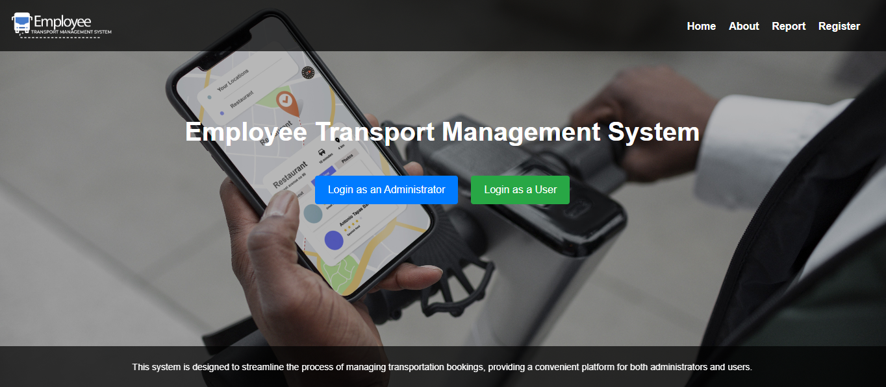

# Employee Transport Management System

The **Employee Transport Management System** is a web-based application designed to streamline and manage the pick-up and drop-off services provided by organizations to their employees. The system facilitates smooth communication between admins and employees, allowing for easy registration, login, and selection of transport time slots.

## Table of Contents
- [Overview](#overview)
- [Features](#features)
- [Technologies Used](#technologies-used)
- [Setup and Installation](#setup-and-installation)
- [Usage](#usage)
- [Screenshots](#screenshots)
- [Folder Structure](#folder-structure)

## Overview
This project aims to manage employee transportation effectively by providing features such as:
- Admin login and management of drivers, vehicles, and time slots.
- Employee registration, login, and the ability to select pick-up/drop-off time slots.

The system ensures a hassle-free experience for both admins and employees.

## Features
### Admin
- **Login**: Admins can log in to access management features.
- **Add Driver**: Admins can add new drivers.
- **Add Vehicle**: Admins can add vehicles to be assigned for employee transport.
- **View Bookings**: Admins can view current bookings and manage time slots.

### Employee
- **Registration**: New employees can register for the service.
- **Login**: Employees can log in with their credentials.
- **Select Time Slot**: Employees can select transport time slots according to their shift timings.

## Technologies Used
- **Frontend**: 
  - HTML5
  - CSS3 (with Bootstrap 5)
  - JavaScript
- **Styling Framework**: Bootstrap 5
- **Responsive Design**: Ensures usability across different screen sizes.

## Setup and Installation
To run this project locally, follow these steps:

1. **Clone the repository**:
    ```bash
    git clone https://github.com/Dallas-iKe/employee-transport-management.git
    ```
2. **Navigate to the project directory**:
    ```bash
    cd employee-transport-management
    ```
3. **Open the `index.html` in your browser**:
    - Simply open the `index.html` file to view the application.

## Usage
1. **Admin**: Log in to manage drivers, vehicles, and time slots for employee transport.
2. **Employee**: Register, log in, and select a time slot for pick-up and drop-off services.

## Screenshots

### Home Screen
  
*Home screen with options for Admin and Employee access.*

## Folder Structure
```
├── assets/                # Folder for images
├── css/                   # CSS files for various pages
├── js/                    # JavaScript files for various pages
├── index.html             # Main page with links to Admin and Employee functionalities
├── UserLogin.html         # Employee login page
├── register.html          # Employee registration page
├── README.md              # Project documentation (this file)
└── ...                    # Other HTML files